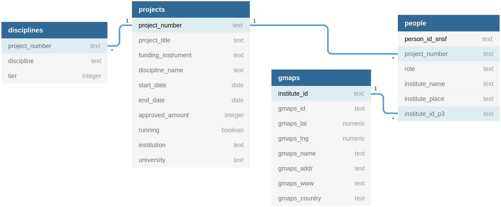

<!-- README.md is generated from README.Rmd. Please edit that file -->

```{r, include = FALSE}
knitr::opts_chunk$set(
  collapse = TRUE,
  comment = "#>"
)
```

# Research programmes for development

<!-- badges: start -->
<!-- badges: end -->

The goal of this project is to show the projects running under the Swiss Programme for Research on Global Issues for Development ([r4d](http://www.r4d.ch/)) on the world map.

### Data dictionary

#### `projects.csv`

> Subset of `P3_GrantExport.csv` from [P3](http://p3.snf.ch/Pages/DataAndDocumentation.aspx).


|Attribute          |Type      |Description                       |
|:------------------|:---------|:---------------------------------|
|project_number     |character |P3 grant id                       |
|project_title      |character |P3 grant title                    |
|funding_instrument |factor    |`r4d`, `SPIRIT`, etc.             |
|start_date         |date      |`%b %Y`                           |
|end_date           |date      |`%b %Y`                           |
|approved_amount    |integer   |Grant size in CHF                 |
|running            |boolean   |Inform whether grant is running   |
|institution        |character |coordinating institution          |
|university         |character |coordinating university           |

#### `people.csv`

|Attribute        |Type      |Description            |
|:----------------|:---------|:----------------------|
|project_number   |character |P3 grant id            |
|person_id_snsf   |character |P3 person id           |
|role             |factor    |[Project as](role)     |
|institute_name   |character |[Details](instname)    |
|institute_place  |character |[Details](instpalce)   |
|institute_id_p3  |character |P3 institute ID        |

#### `gmaps.csv`

|Attribute         |Type      |Description              |
|:-----------------|:---------|:------------------------|
|institute_id      |character |P3 institute number      |
|gmaps_id          |character |Google maps id           |
|gmaps_lat         |numeric   |Latitude                 |
|gmaps_lng         |numeric   |Longitude                |
|gmaps_name        |character |Name on google maps      |
|gmaps_addr        |character |Address on google maps   |
|gmaps_www         |character |Webpage on google maps   |
|gmaps_country     |character |Country on google maps   |

#### `disciplines.csv`

|Attribute         |Type      |Description              |
|:-----------------|:---------|:------------------------|
|project_number    |character |P3 grant id              |
|disciplines       |character |P3 discipline name       |
|tier              |integer   |Discipline hierarchy     |

[role]: http://p3.snf.ch/Pages/DataAndDocumentation.aspx#Projects%20as%20responsible%20Applicant "Example"
[instname]: http://p3.snf.ch/Pages/DataAndDocumentation.aspx#Institute%20Name "Institute name"
[instplace]: http://p3.snf.ch/Pages/DataAndDocumentation.aspx#Institute%20Place "Institute place"

Explore the [raw data](https://flatgithub.com/zambujo/r4data).

### Schema



## Simplified Tree
 
```
.
├── DESCRIPTION
├── LICENSE
├── install.R
├── data
│   ├── disciplines.csv
│   ├── gmaps.csv
│   ├── people.csv
│   ├── projects.csv
│   └── schema.svg
├── docs
│   └── index.html
├── inst
│   └── extdata
│       └── p3-tables.yml
├── README.md
└── Rmd
    ├── explore.Rmd
    └── gather.Rmd

```

## License

Distributed under the MIT License.

## Acknowledgments

See list of packages in [DESCRIPTION file](./DESCRIPTION).
