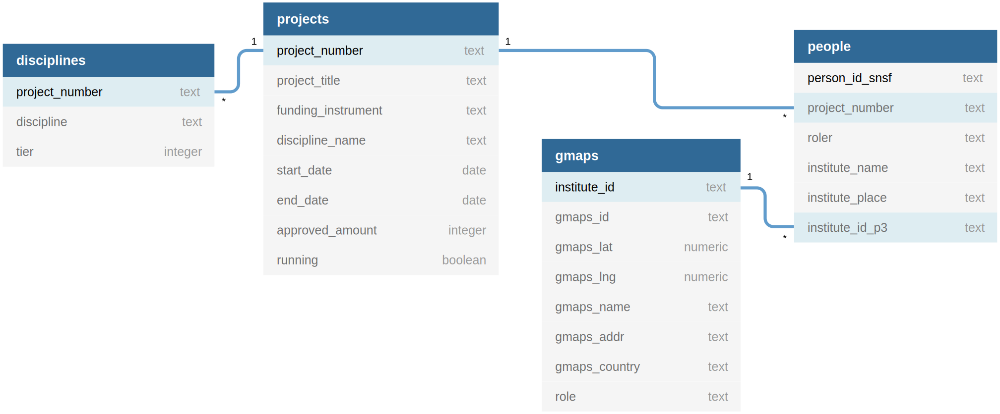

<!-- README.md is generated from README.Rmd. Please edit that file -->

# Swiss research programmes for development

<!-- badges: start -->

<!-- badges: end -->

The goal of this project is to show the projects running under the Swiss
Programme for Research on Global Issues for Development
([r4d](http://www.r4d.ch/)) on the world map.

> [research-earth.ch](https://research-earth.ch/) proof-of-concept

### Data dictionary

#### `projects.csv`

> Subset of `P3_GrantExport.csv` from
> [P3](http://p3.snf.ch/Pages/DataAndDocumentation.aspx).

| Attribute           | Type      | Description                     |
|:--------------------|:----------|:--------------------------------|
| project\_number     | character | P3 grant id                     |
| project\_title      | character | P3 grant title                  |
| funding\_instrument | factor    | `r4d`, `SPIRIT`, etc.           |
| start\_date         | date      | `%b %Y`                         |
| end\_date           | date      | `%b %Y`                         |
| approved\_amount    | integer   | Grant size in CHF               |
| running             | boolean   | Inform whether grant is running |
| institution         | character | coordinating institution        |
| university          | character | coordinating university         |

#### `people.csv`

| Attribute         | Type      | Description          |
|:------------------|:----------|:---------------------|
| project\_number   | character | P3 grant id          |
| person\_id\_snsf  | character | P3 person id         |
| role              | factor    | [Project as](role)   |
| institute\_name   | character | [Details](instname)  |
| institute\_place  | character | [Details](instpalce) |
| institute\_id\_p3 | character | P3 institute ID      |

#### `gmaps.csv`

| Attribute      | Type      | Description            |
|:---------------|:----------|:-----------------------|
| institute\_id  | character | P3 institute number    |
| gmaps\_id      | character | Google maps id         |
| gmaps\_lat     | numeric   | Latitude               |
| gmaps\_lng     | numeric   | Longitude              |
| gmaps\_name    | character | Name on google maps    |
| gmaps\_addr    | character | Address on google maps |
| gmaps\_www     | character | Webpage on google maps |
| gmaps\_country | character | Country on google maps |

#### `disciplines.csv`

| Attribute       | Type      | Description          |
|:----------------|:----------|:---------------------|
| project\_number | character | P3 grant id          |
| disciplines     | character | P3 discipline name   |
| tier            | integer   | Discipline hierarchy |

Explore the [raw data](https://flatgithub.com/zambujo/r4data).

### Schema

## Simplified Tree

    .
    ├── DESCRIPTION
    ├── LICENSE
    ├── install.R
    ├── data
    │   ├── disciplines.csv
    │   ├── gmaps.csv
    │   ├── people.csv
    │   ├── projects.csv
    │   └── schema.svg
    ├── docs
    │   └── index.html
    ├── inst
    │   └── extdata
    │       └── p3-tables.yml
    ├── README.md
    └── Rmd
        ├── explore.Rmd
        └── gather.Rmd

## License

Distributed under the MIT License.

## Acknowledgments

See list of packages in [DESCRIPTION file](./DESCRIPTION).
